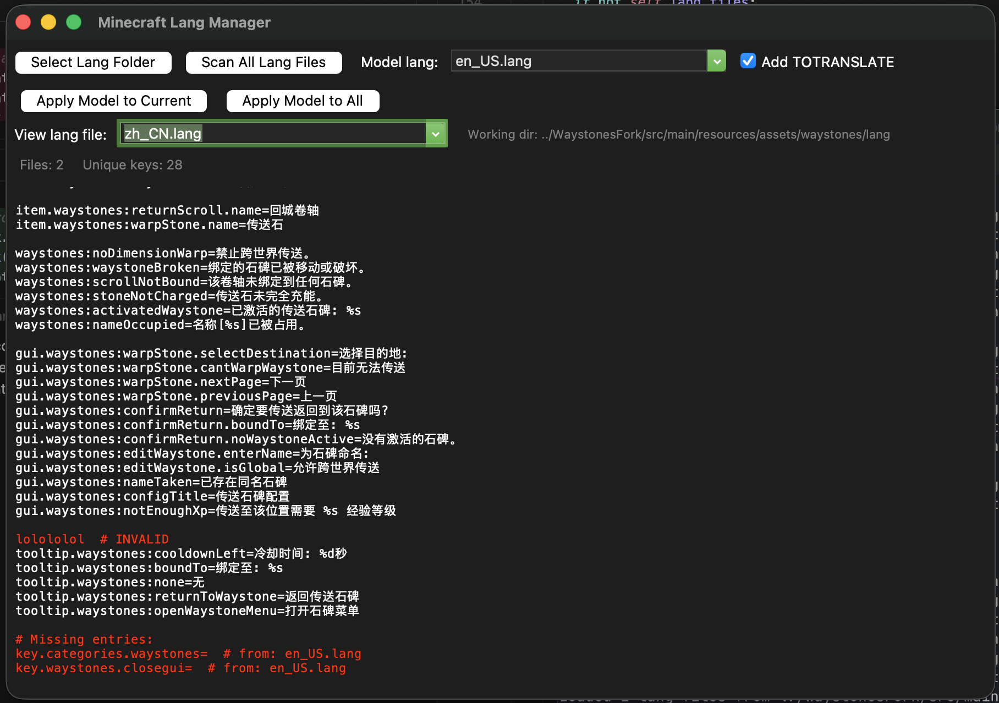

# Minecraft Lang Manager

A tool for managing Minecraft language files (`.lang` files). This tool helps you synchronize translation keys across multiple language files, identify missing translations, and maintain the consistency of lang files.

## Features

- **GUI Mode**: Interactive graphical interface for managing language files
- **Headless Mode**: Command-line automation for batch processing
- **Translation Synchronization**: Apply a model language file to all other language files
- **Missing Translation Detection**: Automatically identify and display missing translation keys
- **Source Tracking**: See which files contain each translation key
- **Comment Preservation**: Intelligently handles comments and invalid lines
- **TOTRANSLATE Flag**: Optionally mark missing translations with "TOTRANSLATE" suffix



## Requirements

- Python 3.x
- tkinter (usually included with Python, but may need to be installed separately on Linux)

## Usage

### GUI Mode

Launch the application without arguments to use the graphical interface:

```bash
python lang_manager.py
```

#### GUI Workflow

1. **Select Lang Folder**: Click "Select Lang Folder" to choose the directory containing your `.lang` files
2. **Scan All Lang Files**: Click "Scan All Lang Files" to parse all language files and collect unique keys. Files can be rescanned if you made changes to them
3. **Select Model Language**: Choose a model language file from the dropdown (e.g., `en_us.lang`)
4. **View Files**: Select any language file from the "View lang file" dropdown to see its contents
5. **Apply Model**:
   - **Apply Model to Current**: Applies the model to the currently displayed file
   - **Apply Model to All**: Applies the model to all other language files

#### Other Features

- **Missing Translations**: Highlighted in red with source file information
- **Invalid Lines**: Non-comment raw lines are marked in red as "INVALID"
- **TOTRANSLATE Checkbox**: When enabled, missing translations are marked with "TOTRANSLATE" suffix

### Command-Line Mode

#### Basic Usage

```bash
# Open GUI with a folder pre-loaded
python lang_manager.py --folder /path/to/lang/folder

# Open GUI with folder and model pre-selected
python lang_manager.py --folder /path/to/lang/folder --model en_us.lang

# Enable TOTRANSLATE flag in GUI
python lang_manager.py --folder /path/to/lang/folder --model en_us.lang --add-totranslate
```

#### Headless Mode (Batch Processing)

Run without GUI to automatically apply model to all files:

```bash
# Apply model to all files (no GUI)
python lang_manager.py --folder /path/to/lang/folder --model en_us.lang --apply

# With TOTRANSLATE suffix
python lang_manager.py --folder /path/to/lang/folder --model en_us.lang --apply --add-totranslate
```

### Command-Line Arguments

| Argument | Description | Required |
|----------|-------------|----------|
| `--folder` | Path to folder containing `.lang` files | Yes (for headless mode) |
| `--model` | Model language file name (e.g., `en_us.lang`) | Yes (for headless mode) |
| `--apply` | Run in headless mode and apply model to all files | No |
| `--add-totranslate` | Add "TOTRANSLATE" suffix to missing translations | No |

## License

Public domain.
